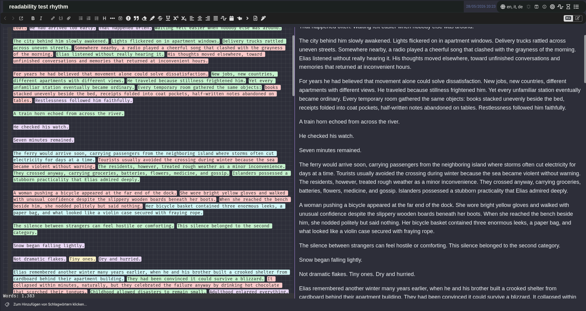
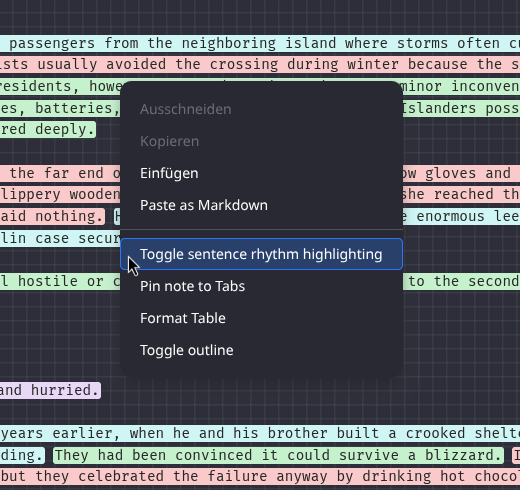
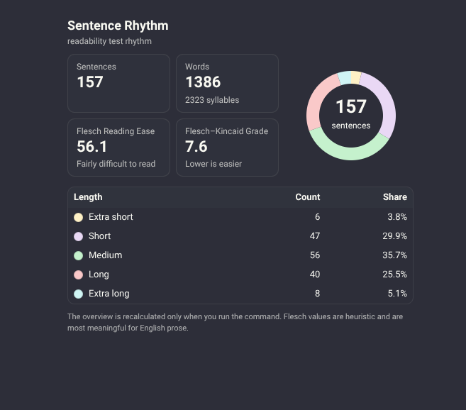

# Sentence Rhythm for Joplin

A Joplin plugin mainly for authors and writers that highlights sentences by length so you can see pacing, variation, and writing rhythm at a glance. It also evaluates the readability based on the [Flesch–Kincaid](https://en.wikipedia.org/wiki/Flesch%E2%80%93Kincaid_readability_tests)-Formula.

  </img> 
  </img>
  </img>	

## Current version

Current packaged version: `0.1.8`

## What it does

- Highlights sentences in the Markdown editor by length.
- Uses five buckets:
  - extra short
  - short
  - medium
  - long
  - extra long
- Lets you customize thresholds and colors.
- Skips HTML tags for both highlighting and counting.
- Can show a manual overview dialog with:
  - sentence distribution
  - donut chart
  - Flesch Reading Ease
  - Flesch–Kincaid Grade
- Supports auto-enabling by tag, for example `wip`.

## Installation

Install this file in Joplin:

- `joplin-sentence-rhythm_v0.1.8.jpl`

In Joplin:

1. Open **Tools → Options → Plugins**
2. Choose **Install from file**
3. Select the `.jpl`
4. Restart Joplin

## Quick usage

### Toggle highlighting
You can toggle the plugin quickly via:

- **Command palette** → `Toggle sentence rhythm highlighting`
- **Note toolbar button**
- **Editor toolbar button**
- **Editor right-click context menu**
- **Keyboard shortcut** if you assign one in Joplin

### Open the overview
Use the command palette:

- `Show sentence rhythm overview`

The overview is recalculated **only when you run the command**, so it stays lightweight during normal editing.

## Auto-enable by tag

There is a setting called:

- **Auto-enable for tag**

If this is set, for example to `wip`:

- notes with that tag open with highlighting enabled
- notes without that tag open with highlighting disabled

If you leave that setting blank, the plugin falls back to the normal enabled/disabled behavior.

## Notes about HTML

HTML tags such as:

- `
`
- ``
- `<i>`
- `
`
- HTML comments

are skipped:

- they are **not highlighted**
- they **do not count** toward sentence length

Visible text between tags is still analyzed normally.

## Readability metrics

The overview dialog includes:

- **Flesch Reading Ease**
- **Flesch–Kincaid Grade**

The reading ease is shown with descriptors such as:

- Very easy to read
- Easy to read
- Fairly easy to read
- Plain English
- Fairly difficult to read
- Difficult to read
- Very difficult to read
- Extremely difficult to read

These values are heuristic and are most meaningful for English prose.

## Inspired by

This plugin is inspired by Adam Fletcher’s Obsidian plugin:

- https://github.com/adamfletcher/obsidian-sentence-rhythm

---

## Short changelog

### v0.1.8
- Readability display changed to descriptive labels like "Very easy to read"
- Added configurable auto-enable-by-tag behavior
- Default tag set to `wip`

### v0.1.7
- Fixed overview dialog sizing so content is readable again
- Kept compact chart/card layout inside the larger dialog

### v0.1.6
- Added smaller overview layout
- Added donut/pie-style chart
- Added Flesch Reading Ease and Flesch–Kincaid Grade

### v0.1.5
- Skipped HTML tags for highlighting and counting
- Added manual overview command with percentages per sentence-length bucket

### v0.1.4
- Added note toolbar toggle button
- Added editor toolbar toggle button
- Added editor context menu toggle entry

### v0.1.3
- Fixed packaged plugin loading by removing incorrect raw `require('api')` usage
- Produced working tar-based `.jpl`

### v0.1.2
- Added required manifest `id`
- Fixed packaging issues from earlier build

### v0.1.1
- Initial packaged version

## Disclaimer
This was massively developped with the help of AI Agents and the code is only partially humanly verified. So use with caution

<pre align="center">

╭┈┈┈┈┈┈┈┈┈┈┈┈┈┈┈┈┈┈┈┈┈┈┈┈┈┈┈┈┈┈┈┈┈┈┈┈┈┈┈┈┈┈┈┈┈┈┈┈┈┈┈┈┈┈┈┈┈┈┈┈┈┈┈┈┈┈┈┈┈┈┈┈┈┈┈╮
·      ＦＥＥＬ ＴＨＥ ＲＨＹＴＨＭ． ＮＯＷ ＧＯ ＷＲＩＴＥ ＹＯＵＲ ＮＯＶＥＬ．      ·
╰┈┈┈┈┈┈┈┈┈┈┈┈┈┈┈┈┈┈┈┈┈┈┈┈┈┈┈┈┈┈┈┈┈┈┈┈┈┈┈┈┈┈┈┈┈┈┈┈┈┈┈┈┈┈┈┈┈┈┈┈┈┈┈┈┈┈┈┈┈┈┈┈┈┈┈╯
</pre>

